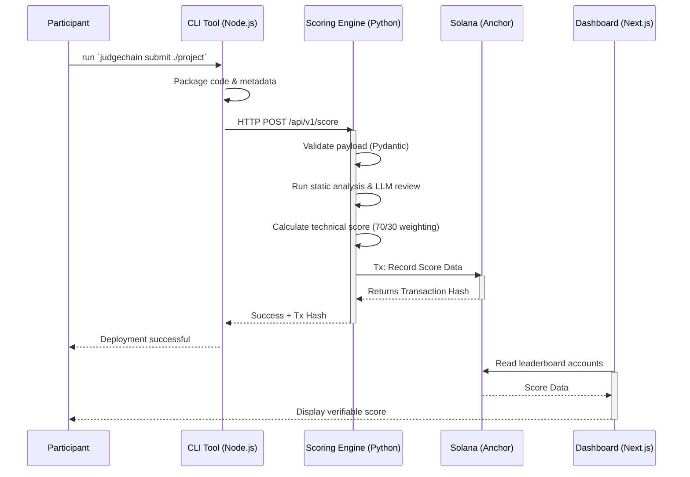

# JudgeChain

**JudgeChain** is a tamper-proof hackathon infrastructure platform built on the Solana ecosystem. It is designed to facilitate fair, transparent, and auditable code evaluation for hackathons. By leveraging static analysis and on-chain records, JudgeChain ensures every submission is independently verifiable.

---

## Architecture Overview

The platform uses a decoupled architecture designed for security, transparency, and scalability, consisting of four main components:

1. **CLI Tool (`/cli`)**: A Node.js CLI used by participants to package and submit their projects seamlessly. Features interactive prompts, project persistence, and certificate minting.
2. **Backend Scoring Engine (`/backend`)**: A highly-secure Python/FastAPI service that receives submissions, evaluates them using static analysis (avoiding RCE vulnerabilities), calculates technical scores, and integrates LLM-powered code review.
3. **Smart Contracts (`/programs/judgechain`)**: Rust-based Anchor smart contracts deployed on Solana Devnet. These contracts immutably record the final evaluation scores, maintain the hackathon leaderboard, and issue soulbound NFT certificates via Metaplex Core.
4. **Web Dashboard (`/dashboard`)**: A Next.js frontend where participants and organizers can visually track submissions, view score breakdowns, verify on-chain records, and manage hackathons.


---

## Submission Workflow

The following sequence details how a participant's submission moves through the system from the CLI to the blockchain:



---

## Directory Structure

```text
inmodel-c/
├── backend/            # Python backend scoring engine (FastAPI, Pydantic)
│   ├── app/
│   │   ├── api/
│   │   │   └── routes/     # API routes (score, judge, certificate)
│   │   ├── models/         # Pydantic schemas & DB models
│   │   ├── scoring/        # Static analysis, LLM & Solana utils
│   │   │   └── analyzers/  # code_quality, test_coverage, documentation, deployment_health, custom_criteria
│   │   ├── auth.py         # Cryptographic signature verification
│   │   ├── database.py     # SQLite setup
│   │   ├── db_store.py     # Submission persistence
│   │   └── problems.py     # Problem definitions
│   ├── idl/            # Anchor IDL for Solana program
│   ├── main.py         # FastAPI app entry point
│   ├── judgechain.db   # SQLite database
│   └── judgechain.json # IDL for Solana program (legacy)
├── cli/                # Node.js CLI submission tool for participants
│   ├── src/
│   │   └── index.ts    # CLI commands (submit, leaderboard, certificate)
│   └── package.json
├── dashboard/          # Next.js / TypeScript Web dashboard
│   ├── src/
│   │   ├── app/        # Pages (home, submit, leaderboard, judge, organizer, organizer/[id], organizer/new, profile)
│   │   ├── components/ # React components (Navbar, Sidebar, WalletButton, SolscanLink, ui/)
│   │   ├── lib/        # Solana connection, API client & useProgram hook
│   │   ├── idl/        # IDL types for TypeScript
│   │   └── types/      # TypeScript definitions
│   └── package.json
├── programs/           # Solana smart contracts (Rust & Anchor)
│   └── judgechain/
│       └── src/
│           └── lib.rs  # Main program (hackathon, submission, scoring, NFT certificates)
├── tests/              # Anchor protocol and integration tests
│   ├── judgechain.ts
│   └── nft_certificates.ts
├── agents/             # AI agent instructions (orchestrator, blockchain, backend, frontend, cli, logger)
├── scripts/            # Utility scripts (git sync, logging initialization)
└── .agent/             # AI Developer Context files
```

---

## Features Implemented

✅ **Smart Contract (Solana/Anchor)**
- Hackathon creation and management (`create_hackathon`)
- NFT collection creation (`create_collection`)
- Submission tracking with on-chain records (`create_submission`)
- Dual scoring system — 70% system / 30% judge (`score_submission`)
- Hackathon finalization (`finalize_hackathon`)
- NFT certificate issuance via Metaplex Core (`issue_certificate`)
- Soulbound certificates with permanent freeze delegate
- PDA-based account management

✅ **Backend Scoring Engine (FastAPI)**
- Static code analysis via modular analyzers (code quality, test coverage, documentation, deployment health, custom criteria)
- GitHub repository utilities (`github_utils.py`)
- LLM-powered code review integration
- Cryptographic signature verification (`auth.py`)
- SQLite database for submission storage (`db_store.py`)
- Solana program integration (`solana_client.py`)
- Certificate metadata generation endpoint
- CORS middleware for frontend

✅ **CLI Tool (Node.js)**
- Interactive submission flow with @clack/prompts
- Project persistence (`.judgenod.json`)
- Smart git detection
- Cryptographic signing with Solana keypair
- Leaderboard viewing
- Certificate command for NFT minting
- Network selection (devnet / mainnet / localnet)

✅ **Web Dashboard (Next.js)**
- Home page with feature showcase
- Submit page for project submission
- Leaderboard with real-time rankings
- Judge panel for manual scoring
- Organizer dashboard with hackathon management (`/organizer`, `/organizer/new`, `/organizer/[id]`)
- Profile page for participant stats
- Wallet connection (Solana wallet adapter)
- Solscan transaction links

---

## Development & Testing

Ensure you have the following prerequisites installed:
* Node.js & npm
* Python 3.9+
* Rust & Cargo
* Solana CLI & Anchor Framework (`^0.30.1`)

### Current Deployment Status

**Program ID (Devnet):** `9vBoPV2ZzcbVPWGzJhA31SDYRZ3efwLZ2HH6BfBLvnm2`

The smart contract is deployed on Solana Devnet with full NFT certificate support via Metaplex Core.

### Environment Variables

**Backend (`backend/.env`)**
```
DATABASE_URL=sqlite:///./judgechain.db
ANCHOR_PROVIDER_URL=https://api.devnet.solana.com
ANCHOR_WALLET=~/.config/solana/id.json
PROGRAM_ID=9vBoPV2ZzcbVPWGzJhA31SDYRZ3efwLZ2HH6BfBLvnm2
```

**Dashboard (`dashboard/.env.local`)**
```
NEXT_PUBLIC_API_URL=http://localhost:8000
NEXT_PUBLIC_RPC_URL=https://api.devnet.solana.com
```

### Local Setup Environments

**1. Solana Smart Contracts**
```bash
# Build the Anchor programs
anchor build

# Run protocol tests (includes NFT certificate tests)
anchor test
```

**2. Backend Scoring Engine**
```bash
cd backend
python -m venv venv
source venv/bin/activate
pip install -r requirements.txt

# Start the development server
python main.py
# or
uvicorn main:app --reload
```

**3. Web Dashboard**
```bash
cd dashboard
npm install
npm run dev
# Dashboard runs on http://localhost:3000
```

**4. CLI Tool**
```bash
cd cli
npm install
npm link  # Makes 'judgechain' command available globally

# Submit a project
judgechain submit

# View leaderboard
judgechain leaderboard

# Mint certificate
judgechain certificate
```

### API Endpoints

| Method | Path | Description |
|--------|------|-------------|
| `POST` | `/api/v1/score` | Submit and score a project |
| `POST` | `/api/v1/judge` | Manual judge scoring |
| `GET`  | `/api/v1/certificate` | Generate certificate metadata |
| `GET`  | `/` | Health check |

---

## Security Philosophy

**No RCE Vulnerabilities**: The backend explicitly does not execute arbitrary user code. Submissions run through structured static analysis, preventing Remote Code Execution (RCE) vectors.

**Deterministic Validation**: Input validation is rigorously handled by comprehensive Pydantic (Backend) and TypeScript (Frontend/CLI) typing.

**Cryptographic Request Signing**: All CLI submissions are signed with the participant's Solana keypair to ensure authenticity and prevent impersonation.

**Soulbound NFT Certificates**: Certificates are issued as Metaplex Core NFTs with a permanent freeze delegate, making them non-transferable and tamper-proof proof of achievement.

**70/30 Scoring Split**: Final scores are computed as 70% automated system score + 30% judge score, recorded immutably on-chain.
