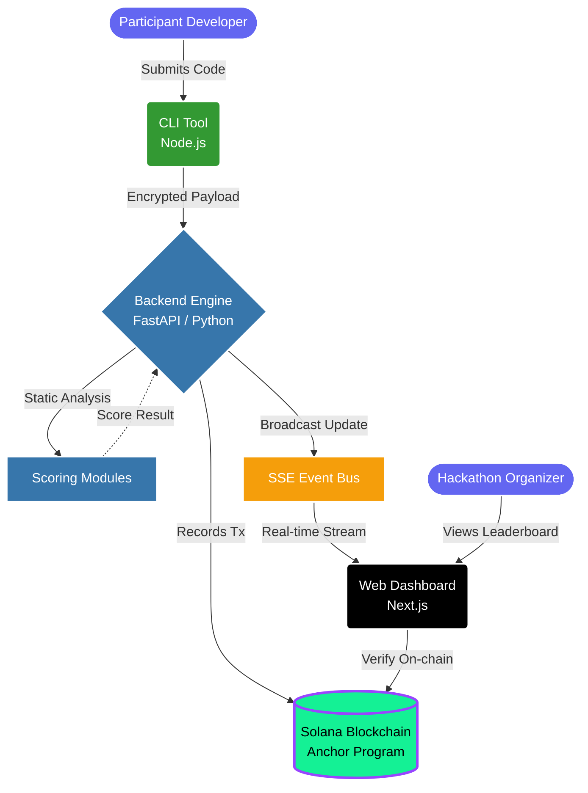
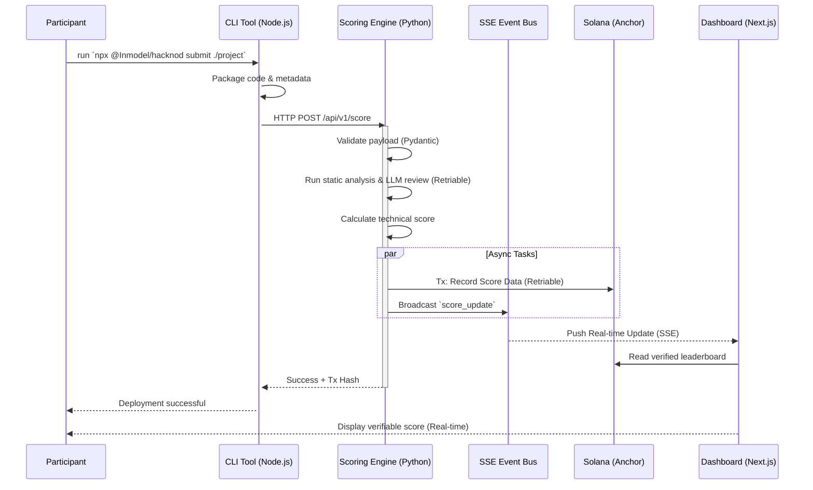

# HackNod (formerly JudgeChain)

**HackNod** is a tamper-proof hackathon infrastructure platform built on the Solana ecosystem. It is designed to facilitate fair, transparent, and auditable code evaluation for hackathons.

**Live Dashboard:** [https://hacknod.inmodel.in](https://hacknod.inmodel.in) (External Repo)
**Backend API:** [https://hacknod-api.railway.app](https://hacknod-api.railway.app) (This Repo)

---

## Architecture Overview

The platform uses a decoupled architecture designed for security, transparency, and scalability, consisting of four main components:

1. **CLI Tool (`/cli`)**: A Node.js CLI used by participants to package and submit their projects seamlessly. Features interactive prompts, project persistence, and certificate minting. Run via `npx @Inmodel/hacknod`.
2. **Backend Scoring Engine (`/backend`)**: A highly-secure Python/FastAPI service that receives submissions, evaluates them using static analysis (avoiding RCE vulnerabilities), calculates technical scores, and integrates LLM-powered code review.
3. **Smart Contracts (`/programs/judgechain`)**: Rust-based Anchor smart contracts deployed on Solana Devnet. These contracts immutably record the final evaluation scores, maintain the hackathon leaderboard, and issue soulbound NFT certificates via Metaplex Core.
4. **Web Dashboard (`/dashboard`)**: A Next.js frontend where participants and organizers can visually track submissions, view score breakdowns, verify on-chain records, and manage hackathons.



---

## Submission Workflow

The following sequence details how a participant's submission moves through the system from the CLI to the blockchain:



---

## Directory Structure

```text
inmodel-c/
├── backend/            # Python backend scoring engine (FastAPI, Pydantic)
│   ├── app/
│   │   ├── api/
│   │   │   └── routes/     # score, judge, certificate, metadata, submissions, events, oauth
│   │   ├── scoring/        # analyzers/ (code_quality, test_coverage, docs, health, etc.)
│   │   ├── utils/          # retry.py (exponential backoff)
│   │   ├── events.py       # In-memory pub/sub event bus
│   │   ├── limiter.py      # Shared rate limiting configuration
│   │   ├── auth.py         # Cryptographic signature verification
│   │   └── db_store.py     # Submission persistence
│   ├── main.py         # FastAPI app entry point
│   └── requirements.txt # slowapi, sse-starlette added
├── cli/                # Node.js CLI submission tool for participants
│   ├── src/
│   │   └── index.ts    # index.ts upgraded with retryFetch()
├── dashboard/          # Next.js / TypeScript Web dashboard
│   ├── src/
│   │   ├── app/        # /leaderboard (SSE enabled), /profile (History enabled)
│   │   ├── components/ # BentoCard, Sidebar (OAuth), SolscanLink
│   │   └── lib/        # useProgram hook, API client
├── programs/           # Solana smart contracts (Rust & Anchor)
├── tests/              # Anchor protocol and integration tests
└── .agent/             # AI Developer Context files
```

---

## Features Implemented

✅ **Hardening & Performance (Phase 2)**
- [x] **Network Robustness**: Generic `@with_retry` decorator with exponential backoff for all operations.
- [x] **Rate Limiting**: Integrated `slowapi` to protect mutation endpoints (10/min) and global routes.
- [x] **Real-time Updates (SSE)**: Event-driven leaderboard updates via Server-Sent Events.
- [x] **Fault Tolerance**: Scoring pipeline wrapped in safe execution blocks.
- [x] **CLI Robustness**: Implemented `retryFetch()` in CLI to handle network drops.

✅ **Backend Scoring Engine (FastAPI)**
- [x] Static code analysis via modular analyzers.
- [x] LLM-assisted code review (GitHub API based, no RCE).
- [x] Dynamic certificate metadata generation (`/api/v1/metadata/{id}.json`).
- [x] Submission history tracking by wallet.
- [x] GitHub OAuth linkage stub.
- [x] Cryptographic signature verification.

✅ **Web Dashboard (Next.js)**
- [x] SSE-powered real-time updates for rankings.
- [x] Submission history and certificate claiming panels.
- [x] GitHub identity linking flow.
- [x] Wallet connection and Solscan deep-linking.


---

## Development & Testing

Ensure you have the following prerequisites installed:
* Node.js & npm
* Python 3.9+
* Rust & Cargo
* Solana CLI & Anchor Framework (`^0.30.1`)

### Current Deployment Status

**Program ID (Devnet):** `9vBoPV2ZzcbVPWGzJhA31SDYRZ3efwLZ2HH6BfBLvnm2`

The smart contract is deployed on Solana Devnet with full NFT certificate support via Metaplex Core.

### Environment Variables

**Backend (`backend/.env`)**
```
DATABASE_URL=sqlite:///./judgechain.db
ANCHOR_PROVIDER_URL=https://api.devnet.solana.com
ANCHOR_WALLET=~/.config/solana/id.json
PROGRAM_ID=9vBoPV2ZzcbVPWGzJhA31SDYRZ3efwLZ2HH6BfBLvnm2
API_BASE_URL=http://localhost:8000
DASHBOARD_URL=http://localhost:3000
GITHUB_CLIENT_ID=your_client_id
GITHUB_CLIENT_SECRET=your_client_secret
```

**Dashboard (`dashboard/.env.local`)**
```
NEXT_PUBLIC_API_URL=http://localhost:8000
NEXT_PUBLIC_RPC_URL=https://api.devnet.solana.com
```

### Local Setup Environments

**1. Solana Smart Contracts**
```bash
# Build the Anchor programs
anchor build

# Run protocol tests (includes NFT certificate tests)
anchor test
```

**2. Backend Scoring Engine**
```bash
cd backend
python -m venv venv
source venv/bin/activate
pip install -r requirements.txt

# Start the development server
python main.py
# or
uvicorn main:app --reload
```

**3. Web Dashboard**
```bash
cd dashboard
npm install
npm run dev
# Dashboard runs on http://localhost:3000
```

**4. CLI Tool**
```bash
cd cli
npm install
npm link  # Makes 'hacknod' command available globally

# Submit a project
hacknod submit

# View leaderboard
hacknod leaderboard

# Mint certificate
hacknod certificate
```

### API Endpoints

| Method | Path | Description |
|--------|------|-------------|
| `POST` | `/api/v1/score` | Submit and score a project (Rate Limited) |
| `POST` | `/api/v1/judge/score` | Manual judge scoring (Rate Limited) |
| `POST` | `/api/v1/certificate/{id}` | Mint NFT certificate (Rate Limited) |
| `GET`  | `/api/v1/metadata/{id}.json` | Serves dynamic NFT metadata |
| `GET`  | `/api/v1/submissions?wallet=...` | Fetch wallet submission history |
| `GET`  | `/api/v1/events/leaderboard` | SSE stream for real-time updates |
| `GET`  | `/api/v1/auth/github` | GitHub OAuth entry point |
| `GET`  | `/` | Health check |

---

## Security Philosophy

**No RCE Vulnerabilities**: The backend explicitly does not execute arbitrary user code. Submissions run through structured static analysis, preventing Remote Code Execution (RCE) vectors.

**Deterministic Validation**: Input validation is rigorously handled by comprehensive Pydantic (Backend) and TypeScript (Frontend/CLI) typing.

**Cryptographic Request Signing**: All CLI submissions are signed with the participant's Solana keypair to ensure authenticity and prevent impersonation.

**Soulbound NFT Certificates**: Certificates are issued as Metaplex Core NFTs with a permanent freeze delegate, making them non-transferable and tamper-proof proof of achievement.

**70/30 Scoring Split**: Final scores are computed as 70% automated system score + 30% judge score, recorded immutably on-chain.

---

## Live on Devnet

- Program: https://solscan.io/account/9vBoPV2ZzcbVPWGzJhA31SDYRZ3efwLZ2HH6BfBLvnm2?cluster=devnet
