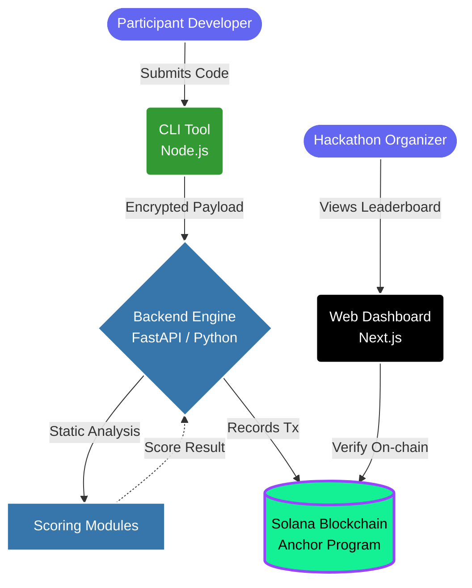
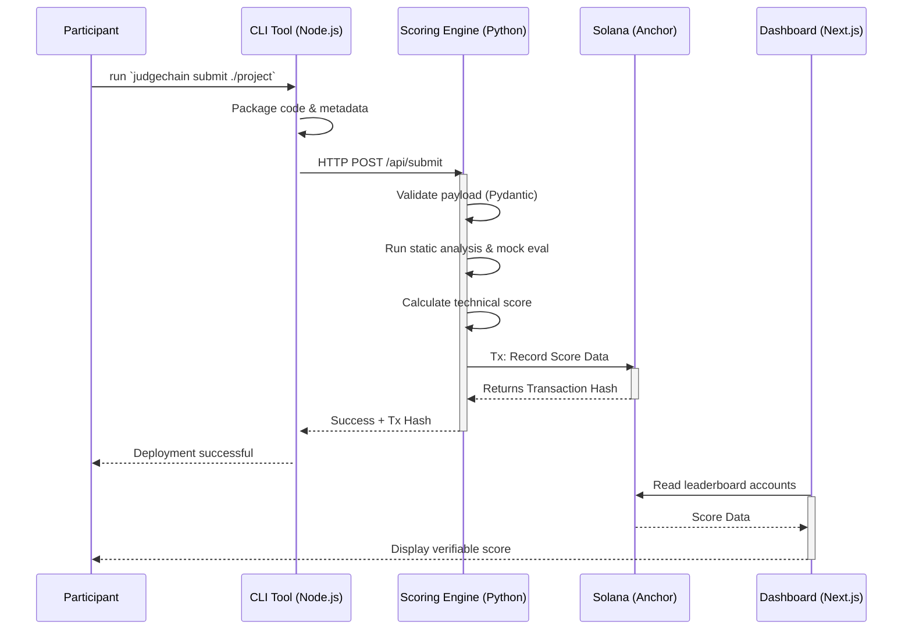

# JudgeChain

**JudgeChain** is a tamper-proof hackathon infrastructure platform built on the Solana ecosystem. It is designed to facilitate fair, transparent, and auditable code evaluation for hackathons. By leveraging static analysis and on-chain records, JudgeChain ensures every submission is independently verifiable.

---

## Architecture Overview

The platform uses a decoupled architecture designed for security, transparency, and scalability, consisting of four main components:

1. **CLI Tool (`/cli`)**: A Node.js CLI used by participants to package and submit their projects seamlessly.
2. **Backend Scoring Engine (`/backend`)**: A highly-secure Python/FastAPI service that receives submissions, evaluates them using static analysis (avoiding RCE vulnerabilities), and calculates technical scores.
3. **Smart Contracts (`/programs/judgechain`)**: Rust-based Anchor smart contracts deployed on Solana. These contracts immutably record the final evaluation scores and maintain the hackathon leaderboard.
4. **Web Dashboard (`/dashboard`)**: A Next.js frontend where participants and organizers can visually track submissions, view score breakdowns, and verify on-chain records.



---

## Submission Workflow

The following sequence details how a participant's submission moves through the system from the CLI to the blockchain:



---

## Directory Structure

```text
inmodel-c/
├── backend/            # Python backend scoring engine (FastAPI, Pydantic)
├── cli/                # Node.js CLI submission tool for participants
├── dashboard/          # Next.js / TypeScript Web dashboard 
├── programs/           # Solana smart contracts (Rust & Anchor)
├── tests/              # Anchor protocol and integration tests
└── .agent/             # AI Developer Context files
```

---

## Development & Testing

Ensure you have the following prerequisites installed:
* Node.js & npm
* Python 3.9+
* Rust & Cargo
* Solana CLI & Anchor Framework (`^0.32.1`)

### Local Setup Environments

**1. Solana Smart Contracts**
```bash
# Build the Anchor programs
anchor build

# Run protocol tests
npx ts-mocha -p ./tsconfig.json -t 1000000 tests/**/*.ts
```

**2. Backend Scoring Engine**
```bash
cd backend
python -m venv venv
source venv/bin/activate
pip install -r requirements.txt

# Start the development server
uvicorn app.main:app --reload
```

**3. Web Dashboard**
```bash
cd dashboard
npm install
npm run dev
```

---

## Security Philosophy

**MVP First**: Prioritize rapid execution and straightforward architecture while maintaining strong security guarantees. 
**No RCE Vulnerabilities**: The backend explicitly does not execute arbitrary user code. Submissions run through structured static analysis, preventing Remote Code Execution (RCE) vectors.
**Deterministic Validation**: Input validation is rigorously handled by comprehensive Pydantic (Backend) and TypeScript (Frontend/CLI) typing.